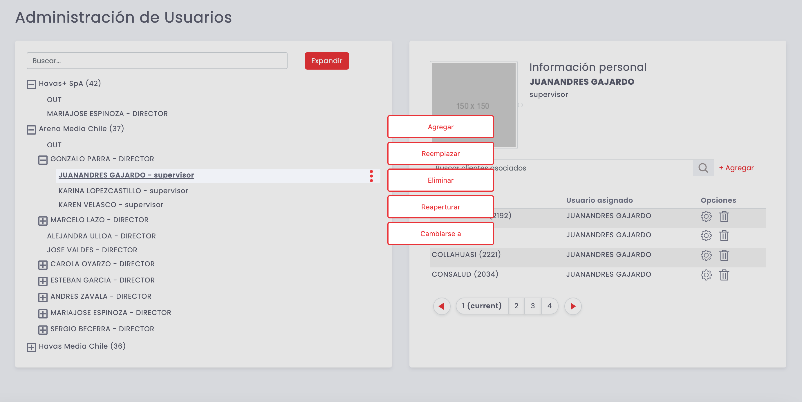

# Manual de Usuario Bonimedios 4

- [Manual de Usuario Bonimedios 4](#manual-de-usuario-bonimedios-4)
  - [Login](#login)
  - [Dashboard](#dashboard)
    - [Filtros](#filtros)
    - [KPI principales](#kpi-principales)
    - [Facturacion Desde - Hasta](#facturacion-desde---hasta)
    - [Distribucion por Medio Clave](#distribucion-por-medio-clave)
    - [Actividad de Directores](#actividad-de-directores)
    - [Billing Medios](#billing-medios)
    - [Share Medio](#share-medio)
  - [Menu Principal y Notificaciones](#menu-principal-y-notificaciones)
  - [Administracion](#administracion)
    - [Catalogos](#catalogos)
      - [Agencias](#agencias)
      - [Medios](#medios)
      - [Soportes](#soportes)
      - [Clientes](#clientes)
    - [Grupos de Bonificacion](#grupos-de-bonificacion)
    - [Usuarios](#usuarios)
    - [Periodos](#periodos)
    - [Metas por Agencia](#metas-por-agencia)
    - [Procesar Real](#procesar-real)
  - [Budget](#budget)
    - [Metas](#metas)
    - [Realizar](#realizar)
    - [Aprobar](#aprobar)
    - [Consolidar](#consolidar)
  - [Proyectados](#proyectados)
    - [Metas](#metas-1)
    - [Realizar](#realizar-1)
    - [Aprobar](#aprobar-1)
    - [Consolidar](#consolidar-1)
  - [Mejor Proyectado](#mejor-proyectado)
    - [Metas](#metas-2)
    - [Realizar](#realizar-2)
    - [Aprobar](#aprobar-2)
    - [Consolidar](#consolidar-2)
  - [Reportes](#reportes)
    - [Data](#data)
    - [BI](#bi)
  - [Notificaciones](#notificaciones)
  - [Reglas de Negocio](#reglas-de-negocio)

## Login

El acceso al sistema comienza con el pantalla de bienvenida y login del sistema. Aqui tendremos que ingresar nuestro usuario y contraseña de red, en la forma :

> nombre.apellido / contraseña de red

Si estos datos son correctos, el sistema presentará el [Dashboard](#Dashboard), de lo contrario, se indicará con una alerta que el nombre de usuario o la contraseña son incorrectos, en cuyo caso debes reingresar los datos correctamente. 

_Recuerda validar con la [Mesa de Ayuda](mailto:mesa.ayuda@havasit.com) que tu usuario y contraseña no se encuentren bloqueados_

## Dashboard

El Home o Dashboard, es la sección principal del sistema y desde donde tendrás el control de todos los detalles, tanto vigentes como históricos, de tu cartera actual.

A continuación, describimos cada sección del contenido del dashboard. Cabe destacar que, dependiendo del perfil de tu usuario, podrás ver o no algunas de las secciones descritas.

### Filtros

Este filtro te permite cambiar el perído de análisis de cada KPI y tabla del Dashboard para que considere los datos ingresados para realizar los cálculos.

- *Año:* establece el año de proceso deseado, al cambiar de año se actualiza la lista de Períodos de acuerdo a los datos existentes en el año seleccionado. Por omisión, estará seleccionado el año actual
- *Forecast:*, Permite seleccionar el período, dentro del año establecido, sobre el que se desea consultar. Por omisión estará seleccionado el periodo en curso.
- *Ver:* permite filtrar el conjunto de clientes sobre el que deseo revisar datos
- *Período:* permite filtar los meses del análisis

_Estos filtros no tienen efecto en el ingreso de datos, solo son utlizados para filtrar los datos del Dashboard_

### KPI principales

Esta sección presenta los principales indicadores de gestión de nuestra cartera, esta compuesta por los siguientes KPI:

- *INVERSION NETA:* representa el total de la inversión acumulada a la fecha seleccionada
- *CUM:* el es porcentaje de cumplimiento de la inversión _REAL_ respecto de lo _PROYECTADO_ a la fecha.
- *CUM x MEDIO:* es el promedio del porcentaje de cumplimiento por medio a la fecha

### Facturacion Desde - Hasta

El siguiente componente nos muestra el detalle de la facturación acumulada a la fecha seleccionada en el filtro, abierta por cada uno de los Medios de la plataforma e indicando en cada columna:

- *Billing Total*, el total del billing para este medio a la fecha (año completo)
- *Ene - Dic*, el total del billing para los meses indicados en el filtro
- *Share Total*, el procentaje que representa cada Medio respecto del total de los billings del período
- *Cum x Medio*, el porcentaje de cumplimiento de cada Medio para los datos del _REAL_ respecto de los _PROYECTADOS_

### Distribucion por Medio Clave

*Solo rol de administrador*

Este componente nos presenta una distribución de la inversión y el share respecto del total para cada Medio Clave (según configuración), indicando además si es Pure Player.

### Actividad de Directores

*Solo rol de administrador*

Cuadro que nos muestra el detalle del cumplimiento de proceso de proyección mensual para cada director cargado en el sistema. Solo cuando el 100% de ellos han cumplido la etapa final, es posible cerrar el período actual y abrir el siguiente. Este control permite que el administrador tenga, además de una confirmación rápida del estado de cada equipo, entrar al detalle mediante el link *_Ver más detalle_* y tomar el control de la proyección de un equipo forzando su aprobación.

### Billing Medios

Este es un cuadro resumen de los billings del período, agrupando los medios homogéneamente según su tipo:

- *DIG*, plataformas digitales
- *PPP*, Pure Players
- *DP*, 
- *TV*, TV abierta
- *TVP* TV paga

### Share Medio

De igual modo que el control anterior, esta sección nos entrega un resumen del billing agrupado indicando el porcentaje de cada subconjunto respecto del total del período:

- *SOD,* Share of Digital
- *SOPPP,* Share of Pure Player
- *SDPPPD,* Share of Pure Player Digital
- *SOPD,* Share of Pure Digital
- *SOTV,* Share of TV Abierta
- *SOTVP,* Share of TV Paga

## Menu Principal y Notificaciones

El menu principal agrupa todas las funcionalidades del sistema, en un conjunto lógico de accesos y que, dependiendo del rol del usuario conectado, desplegará o no, cada sección.

*Perfiles*

- *Administrador*, gestión, administración y configuración de la plataforma. Tiene accesos a todos los datos independiente de las carteras de clientes de cada usuario.
- *Director*, puede crear, eliminar, aprobar, rechazar e ingresar (modificar) los datos de: budget, proyección mensual y mejor proyectado. También puede descargar informes de su cartera de clientes asignada
- Supervisor, puede ingresar (modificar) los datos de: budget, proyección mensual y mejor proyectado

*Nivel de permisos por rol*

|Opcion|Rol|Descripcion|
|-----|------|------|
|Administracion|Administrador|Configuracion del sistema|
|Budget|Todos|Ingreso proyección para el año siguiente|
|Proyección|Todos|Ingreso de proyección mensual|
|Mejor Proyectado|Todos|Ingreso del mejor proyectado durante mes en curso|
|Reportes|Todos|Descarga de reportes e informes|

En la sección superior derecha de la aplicación, encontraremos el ícono de acceso a la sección de [notificaciones](#notificaciones) y el botón de logout (salir) del sistema.

## Administracion

El menú de administración, reservado para los roles de *Administrador*, nos permite ajustar la configuración del sistema, sincronizar datos con MMS, gestión de los períodos y procesar manualmente las bonificaciones.

### Catalogos

Los catálogos son el equivalente a las tablas de _"maestros"_ del sistema, salvo que en nuestro caso, estas vienen sincronizadas desde MMS. El proceso de sincronización puede ser manual mediante el botón de sincronización (adicionalmente esta sincronización se ejecuta automáticamente cuando se actualizan los datos desde MMS):

Existen cuatro tablas de maestros, las cuales pueden ser seleccionadas a partir del *selector de catálogo*

La equivalencia entre los maestros de MMS y su correspondiente uso en Bonimedios es el siguiente:

|Bonimedios| MMS|Ejemplo|Observacion|
|-----|----|--|--|
|Agencia|Agencias|Arena Media Chile (37)|Todas las agencias, excepto las filtradas por las [reglas de negocio](#reglas-de-negocio)|
|Medio|Submedio|PRENSA GRATUITA (10)|Considera los *submedios*, excepto aquellos filtrados por las [reglas de negocio](#reglas-de-negocio)|
|Soporte|Soporte + Medio + Proveedor|13C (CANAL 13) (17) - CANAL 13 S.P.A.|Consolida todos los soportes por medio y proveedor en un equivalente para cada uno de ellos, conformado por la descripcion del soporte y la descripcion del proveedor ("soporte - proveedor") además de la información del Medio como referencia, excepto los filtrados por las [reglas de negocio](#reglas-de-negocio)|
|Cliente|Grupo|GILDEMEISTER (1)|A partir de los grupos de MMS, solo aquellos no dados de baja o filtrados por las [reglas de negocio](#reglas-de-negocio)|

Todos los catálogos comparten una funcionalidad similar:

- En la parte *izquierda* de la pantalla, el catálogo Bonimedios
- En la parte *derecha* de la pantalla, el equivalente en MMS
  

Al seleccionar un elemento del catálogo Bonimedios, se muestran sus relaciones en la sección de MMS. 

Inicialmente cada dato de Bonimedios esta relacionado con un equivalente desde MMS.

Es posible asignar múltiples datos de MMS a un solo registro de Bonimedios. Esto se logra con el boton de *Añadir Item*. El resultado de esta operación es que Bonimedios, tratará cualquier información que provenga de MMS desde alguno de los registros enlazados como si fuesen uno solo en Bonimedios, lo que en la práctica agrupará (o sumará) los valores de todos ellos en uno solo. 

Esto puede ser especialmente útil en casos tales como en los que MMS tiene cargada información en múltiples grupos que en realidad son el mismo, pero duplicados erróneamente. En este contexto, podemos asociar todos ellos a uno solo en Bonimedios, logrando una consolidación efectiva de la información.

#### Agencias

 
 
 
 

#### Medios

 
 
 
 
 

#### Soportes

 
 
 
 
 

#### Clientes

 
 
 
 
 

### Grupos de Bonificacion

 
 
 
 

### Usuarios

 
 
 
 
 
 
 

### Periodos

 
 

### Metas por Agencia

### Procesar Real

## Budget

### Metas

### Realizar

### Aprobar

### Consolidar

## Proyectados

### Metas

### Realizar

### Aprobar

### Consolidar

## Mejor Proyectado

### Metas

### Realizar

### Aprobar

### Consolidar

## Reportes

### Data

### BI

## Notificaciones

## Reglas de Negocio
